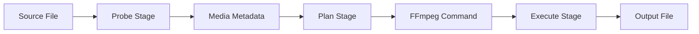

# Conversion Pipeline

The conversion pipeline is the heart of Honeymelon, transforming user intent into optimized FFmpeg commands. It consists of three sequential stages: **Probe**, **Plan**, and **Execute**.

## Pipeline Overview



Each stage has specific responsibilities and can fail independently, allowing for precise error handling and reporting.

## Stage 1: Probe

**Purpose**: Extract comprehensive metadata from the source file using FFprobe.

### Probe: Implementation

**Location**: [src/lib/ffmpeg-probe.ts](https://github.com/honeymelon-app/honeymelon/blob/main/src/lib/ffmpeg-probe.ts) (frontend) and [src-tauri/src/ffmpeg_probe.rs](https://github.com/honeymelon-app/honeymelon/blob/main/src-tauri/src/ffmpeg_probe.rs) (backend)

**Process**:

1. Frontend invokes Tauri command `probe_media`
1. Rust spawns FFprobe process:

   ```rust
   ffprobe -v quiet -print_format json -show_format -show_streams input.mp4
   ```

1. Parse JSON output to extract metadata
1. Return structured data to frontend

### Extracted Metadata

`ProbeSummary` captures the normalized fields used for planning (duration, size, codecs, frame rate, channels, and color metadata when present). See `src-tauri/src/ffmpeg_probe.rs` and `src/lib/types.ts` for the current structure.

### Error Handling

Common probe errors:

- **File not found**: Invalid path
- **Corrupted file**: FFprobe cannot parse
- **Unsupported format**: No valid streams detected
- **Permission denied**: Insufficient file access

Each error is caught and reported with a user-friendly message.

## Stage 2: Plan

**Purpose**: Determine the optimal conversion strategy based on probe results, selected preset, and quality tier.

### Plan: Implementation

**Location**: [src/lib/ffmpeg-plan.ts](../../src/lib/ffmpeg-plan.ts) with planner/runner clients in `src/composables/orchestrator/`

**Process**:

```typescript
function planJob(context: PlannerContext): PlannerDecision;
```

### Preset-Driven Planning

Presets define the target container and codecs. The planners decide copy vs transcode based on whether the source codecs already match the preset targets (or the preset is remux-only).

### Stream Action Determination

For each stream (video, audio), the planner determines one of three actions:

#### Copy (Remux)

**Condition**: Source codec already matches the preset target (or preset is `copy`)

```typescript
if (probe.videoCodec === 'h264' && preset.video.codec === 'h264') {
  videoAction = 'copy';
}
```

**FFmpeg Argument**: `-c:v copy`

**Benefits**:

- Extremely fast (500-1000+ fps)
- Zero quality loss
- Minimal resource usage

#### Transcode

**Condition**: Source codec differs from the preset target and the preset is not `copy`

```typescript
if (probe.videoCodec === 'vp9' && preset.video.codec === 'h264') {
  videoAction = 'transcode';
  videoCodec = 'h264';
}
```

**FFmpeg Arguments** (example):

```bash
-c:v libx264

```

#### Drop

**Condition**: No source stream or preset explicitly disables the stream

```typescript
if (!probe.videoCodec || preset.video.codec === 'none') {
  videoAction = 'drop';
}
```

**FFmpeg Argument**: `-vn` (no video), `-an` (no audio), or `-sn` (no subtitles)

### Plan Output

```typescript
interface PlannerDecision {
  preset: Preset;
  ffmpegArgs: string[];
  remuxOnly: boolean;
  notes: string[];
  warnings: string[];
}
```

### Example Plans

#### Example 1: Remux MKV > MP4

```text
Input: video.mkv (H.264 + AAC)
Preset: video-to-mp4
Quality: Fast

Plan:
  Video: H.264 > Copy (compatible)
  Audio: AAC > Copy (compatible)

FFmpeg Command:
  ffmpeg -i video.mkv -c:v copy -c:a copy output.mp4

```

#### Example 2: Transcode MKV > MP4

```text
Input: video.mkv (VP9 + Opus)
Preset: video-to-mp4
Quality: Balanced

Plan:
  Video: VP9 > Transcode to H.264 (incompatible)
  Audio: Opus > Transcode to AAC (incompatible)

FFmpeg Command:
  ffmpeg -i video.mkv -c:v libx264 -c:a aac output.mp4

```

#### Example 3: MKV Remux

```text
Input: video.mov (H.264 + AAC)
Preset: video-to-mkv
Quality: Fast

Plan:
  Video: H.264 > Copy
  Audio: AAC > Copy

FFmpeg Command:
  ffmpeg -i video.mov -c:v copy -c:a copy output.mkv

```

## Stage 3: Execute

**Purpose**: Run FFmpeg with the generated plan and monitor progress.

### Execute: Implementation

**Location**: runner modules under `src-tauri/src/runner` (backend) and frontend orchestration stack (`use-job-orchestrator.ts`, `orchestrator/planner-client.ts`, `orchestrator/runner-client.ts`, `orchestrator/event-subscriber.ts`)

### Process

1. **Validate Job**: Check concurrency limits
2. **Resolve FFmpeg Path**: Find FFmpeg binary
3. **Build Command**: Construct complete FFmpeg command
4. **Spawn Process**: Start FFmpeg as child process
5. **Stream Progress**: Parse stderr for progress updates
6. **Handle Completion**: Process exit code and finalize

### Progress Parsing

FFmpeg progress is read from stderr. The monitor accepts both key-value progress lines (`out_time=...`) and inline status lines (`time=...`), extracting:

- `processed_seconds`
- `fps`
- `speed`

### Event Emission

As FFmpeg runs, the backend emits events to the frontend:

```rust
app.emit("ffmpeg://progress", ProgressPayload {
    job_id: job.id.clone(),
    progress: ProgressMetrics {
        processed_seconds: Some(5.0),
        fps: Some(30.0),
        speed: Some(1.0),
    },
    raw: line,
})?;

```

Frontend listens and updates UI:

```typescript
listen<ProgressPayload>('ffmpeg://progress', (event) => {
  const job = findJob(event.payload.jobId);
  job.progress = event.payload.progress;
});
```

### Completion Handling

FFmpeg exits with a status code:

- **0**: Success
- **Non-zero**: Error occurred

**Success Path**:

1. Validate the temp output file (exists, non-zero size, expected streams)
2. Atomically move temp file (`<stem>.tmp.<ext>`) to the final location
3. Emit `ffmpeg://completion` event
4. Update job state to `completed`

**Error Path**:

1. Classify stderr output into an error category
2. Clean up partial output file
3. Emit `ffmpeg://completion` with error details
4. Update job state to `failed` with a user-facing message

### Cancellation

User can cancel a running job:

1. Frontend sends cancel request
2. Backend kills FFmpeg process (`SIGTERM`)
3. Clean up partial output file
4. Update job state to `cancelled`

## Pipeline Optimizations

### Hardware Acceleration

When encoding to H.264, the planner prefers hardware encoders (such as `h264_videotoolbox`) if they are available in the detected FFmpeg capabilities. Otherwise it falls back to software encoders (for example `libx264`).

### Two-Pass Encoding (Future Feature)

For optimal bitrate control:

**Pass 1**: Analyze video

```bash
ffmpeg -i input.mp4 -c:v libx264 -b:v 2M -pass 1 -f null /dev/null

```

**Pass 2**: Encode with analysis

```bash
ffmpeg -i input.mp4 -c:v libx264 -b:v 2M -pass 2 output.mp4
```

## Error Recovery

### Retryable Errors

Some errors can be automatically retried:

- **Temporary resource issues**: Wait and retry
- **FFmpeg timeout**: Increase timeout and retry
- **Disk space (momentary)**: Wait for space, retry

### Non-Retryable Errors

Some errors require user intervention:

- **Corrupted file**: Cannot be fixed automatically
- **Insufficient permissions**: User must grant access
- **Unsupported codec**: Cannot be encoded

## Next Steps

- Understand [FFmpeg Integration](/architecture/ffmpeg) details
- Explore [State Management](/architecture/state) for job tracking
- Review [Tech Stack](/architecture/tech-stack) choices
- See [Pipeline Internals](/architecture/pipeline-internals) for implementation details and error classification
