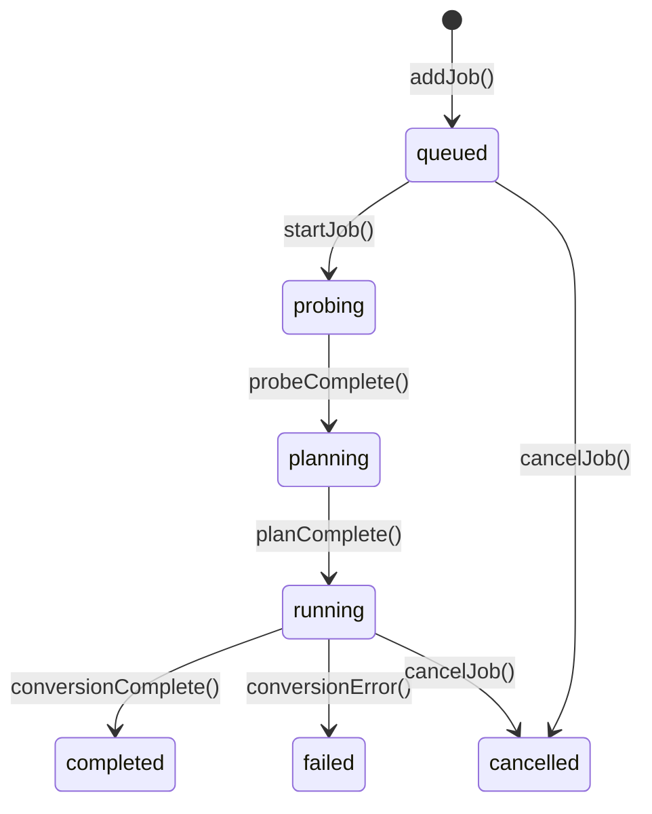

# State Management

Honeymelon uses Pinia for reactive state management with discriminated union types for type-safe state transitions. This document explains the state architecture and patterns used throughout the application.

## Pinia Stores

### Job Stores

- `src/stores/job-queue.ts`: Enqueue/start/cancel, concurrency tracking, duplicate detection via `jobService`
- `src/stores/job-state.ts`: Mutations validated by `job-lifecycle.ts`
- `src/stores/job-progress.ts`: Aggregated progress, ETA, speed metrics
- `src/stores/job-logs.ts`: Circular buffer of recent stderr lines per job
- `src/stores/jobs.ts`: Thin facade composing the above utilities for legacy consumers

```typescript
// Usage (facade):
const jobs = useJobsStore();

// Enqueue a file
const id = jobs.enqueue('/path/to/file.mp4', 'video-to-mp4', 'balanced');

// Inspect queue state
const running = jobs.activeJobs;
```

### Preferences Store

**Location**: `src/stores/prefs.ts` (persists via `src/lib/store.ts`, which uses `@tauri-apps/plugin-store` in desktop builds and falls back to in-memory/local storage in tests)

### Job State Representation

Job records wrap the discriminated union state along with metadata used by stores/services:

```typescript
type JobState =
  | { status: 'queued'; enqueuedAt: number }
  | { status: 'probing'; enqueuedAt: number; startedAt: number }
  | { status: 'planning'; enqueuedAt: number; startedAt: number; probeSummary: ProbeSummary }
  | { status: 'running'; enqueuedAt: number; startedAt: number; progress: JobProgress }
  | {
      status: 'completed';
      enqueuedAt: number;
      startedAt: number;
      finishedAt: number;
      outputPath: string;
    }
  | { status: 'failed'; enqueuedAt: number; startedAt: number; finishedAt: number; error: string }
  | { status: 'cancelled'; enqueuedAt: number; startedAt: number; finishedAt: number };

interface JobRecord {
  id: string;
  path: string;
  presetId: string;
  tier: QualityTier;
  exclusive: boolean;
  state: JobState;
  createdAt: number;
  updatedAt: number;
  logs: string[];
}
```

### State Transitions



#### Shared Lifecycle Module

- Frontend transitions are now codified in `src/lib/job-lifecycle.ts`, which enumerates allowed edges, exposes `isActiveStatus` / `isTerminalStatus`, and provides a DEV-only `jobLifecycle.ensureTransition` guard that raises when code attempts to skip a required step.
- The same state chart lives in Rust via `src-tauri/src/job_lifecycle.rs`, and the integration tests in `src-tauri/tests/command_integration_tests.rs` assert that `can_transition_status` mirrors the TypeScript contract.
- `src/stores/job-state.ts` calls the shared guard before every mutation (probing > planning > running > terminal) so Pinia, orchestrator composables, and background listeners all honor the canonical job lifecycle.

### Type-Safe Updates

Shared lifecycle guards prevent invalid transitions such as `queued > completed`:

```typescript
import { jobLifecycle } from '@/lib/job-lifecycle';

jobService.update(jobId, (current) => {
  const nextState = reducer(current.state);
  jobLifecycle.ensureTransition(current.state, nextState);
  return {
    ...current,
    state: nextState,
    updatedAt: Date.now(),
  };
});
```

The Rust backend mirrors this check inside `can_transition_status` so commands and frontend stores remain consistent.

## Reactive Patterns

### Computed Properties

Derive state from the store:

```typescript
const runningJobs = computed(() => jobs.value.filter((j) => j.state.status === 'running'));

const queuedJobs = computed(() => jobs.value.filter((j) => j.state.status === 'queued'));

const completedCount = computed(
  () => jobs.value.filter((j) => j.state.status === 'completed').length,
);

const totalProgress = computed(() => {
  const running = runningJobs.value;
  if (running.length === 0) return 0;

  const sum = running.reduce((acc, job) => acc + (job.state.progress?.ratio ?? 0), 0);
  return sum / running.length;
});
```

### Watchers

React to state changes:

```typescript
watch(
  () => runningJobs.value.length,
  (newCount, oldCount) => {
    if (newCount < concurrencyLimit.value) {
      // Start next queued job
      startNextJob();
    }
  },
);

watch(
  () => prefsStore.maxConcurrency,
  () => {
    // Adjust concurrency if needed
  },
);
```

## Job Orchestration

### Composables

- `src/composables/use-app-orchestration.ts`: Bridges UI events (drop, menu, shortcuts) into queue operations
- `src/composables/use-capability-gate.ts`: Loads capability snapshots, determines preset readiness, and surfaces warnings
- `src/composables/use-desktop-bridge.ts`: Wires drag/drop + menu handlers when running inside the Tauri shell
- `src/composables/use-job-orchestrator.ts`: Coordinates planner/runner clients and maintains concurrency sync with the backend
- `src/composables/orchestrator/planner-client.ts`: Frontend wrapper around planner commands (`probe`, `plan`)
- `src/composables/orchestrator/runner-client.ts`: Bridges to runner commands (`start_job`, `cancel_job`, `set_max_concurrency`)
- `src/composables/orchestrator/event-subscriber.ts`: Centralizes `listen`/`unlisten` for `ffmpeg://*` events with a shared teardown helper used in tests

```typescript
const teardown = createOrchestratorTeardown();

const planner = createPlannerClient({ invoke });
const runner = createRunnerClient({ invoke });
const subscriber = createEventSubscriber({ listen });

subscriber.onProgress((payload) => {
  jobsStore.updateJobProgress(payload.job_id, {
    percentage: payload.percentage,
    fps: payload.fps,
    etaSeconds: payload.eta_seconds,
  });
});

subscriber.onCompletion((payload) => {
  if (payload.success) {
    jobsStore.completeJob(payload.job_id, payload.output_path);
    startNextJob();
  } else {
    jobsStore.failJob(payload.job_id, payload.error);
  }
});

onBeforeUnmount(() => {
  teardown.cleanup();
});
```

## Persistence

### Preferences Persistence

Preferences are persisted via `src/lib/store.ts` to `settings.json` in the app support directory, with in-memory/local storage fallback in test contexts.

### Job State Persistence (Future Feature)

Future versions will persist job queue:

- Resume interrupted conversions
- Restore queue on app restart
- Scheduled/deferred processing

## Performance Optimizations

### Shallow Reactivity

For large job arrays, use shallow refs:

```typescript
const jobs = shallowRef<Job[]>([]);

// Update requires full replacement
jobs.value = [...jobs.value, newJob];
```

### Debounced Updates

Throttle frequent updates:

```typescript
import { useDebounceFn } from '@vueuse/core';

const debouncedUpdateProgress = useDebounceFn((jobId, progress) => {
  updateJobProgress(jobId, progress);
}, 100); // Update UI at most every 100ms
```

### Batch Operations

Process multiple jobs efficiently:

```typescript
async function cancelAllJobs() {
  await app.cancelAll();
}
```

## Testing State Management

### Unit Tests

**Locations**:

- Job queue/service coverage: `src/stores/__tests__/job-queue.test.ts`, `src/services/__tests__/job-service.test.ts`
- Orchestrator integration specs: `src/composables/__tests__/use-job-orchestrator.test.ts`
- Lifecycle guard unit tests: `src/lib/__tests__/job-lifecycle.test.ts`

```typescript
import { setActivePinia, createPinia } from 'pinia';
import { useJobsStore } from '../jobs';

describe('Jobs Store', () => {
  beforeEach(() => {
    setActivePinia(createPinia());
  });

  it('adds a job to the queue', () => {
    const store = useJobsStore();
    store.enqueue('/path/to/file.mp4', 'video-to-mp4', 'balanced');

    expect(store.jobs).toHaveLength(1);
    expect(store.jobs[0].status).toBe('queued');
  });

  it('transitions job from queued to probing', async () => {
    const store = useJobsStore();
    store.enqueue('/path/to/file.mp4', 'video-to-mp4', 'balanced');

    await store.startJob(store.jobs[0].id);

    expect(store.jobs[0].status).toBe('probing');
  });

  it('respects concurrency limit', async () => {
    const store = useJobsStore();
    store.setConcurrency(2);

    // Add 3 jobs
    store.enqueue('/file1.mp4', 'video-to-mp4', 'balanced');
    store.enqueue('/file2.mp4', 'video-to-mp4', 'balanced');
    store.enqueue('/file3.mp4', 'video-to-mp4', 'balanced');

    // Start all
    await Promise.all(store.jobs.map((j) => store.startJob(j.id)));

    // Only 2 should be running
    const running = store.jobs.filter((j) => j.status === 'running');
    expect(running).toHaveLength(2);
  });
});
```

## Best Practices

### 1. Immutable Updates

Always create new objects/arrays:

```typescript
// Bad
job.progress = 50;

// Good
jobs.value = jobs.value.map((j) => (j.id === jobId ? { ...j, progress: 50 } : j));
```

### 2. Centralized State

All state lives in stores, not components:

```typescript
// Bad: Local component state
const jobs = ref([]);

// Good: Pinia store
const jobsStore = useJobsStore();
const jobs = jobsStore.jobs;
```

### 3. Computed Derived State

Don't duplicate state:

```typescript
// Bad: Duplicate state
const completedCount = ref(0);

// Good: Computed from source
const completedCount = computed(() => jobs.value.filter((j) => j.status === 'completed').length);
```

### 4. Actions for Mutations

Use store actions, not direct mutations:

```typescript
// Bad: Direct mutation
store.jobs.push(newJob);

// Good: Action
store.addJob(newJob);
```

## Next Steps

- Review the [Tech Stack](/architecture/tech-stack) choices
- Understand the [Conversion Pipeline](/architecture/pipeline)
- Explore [FFmpeg Integration](/architecture/ffmpeg) details
