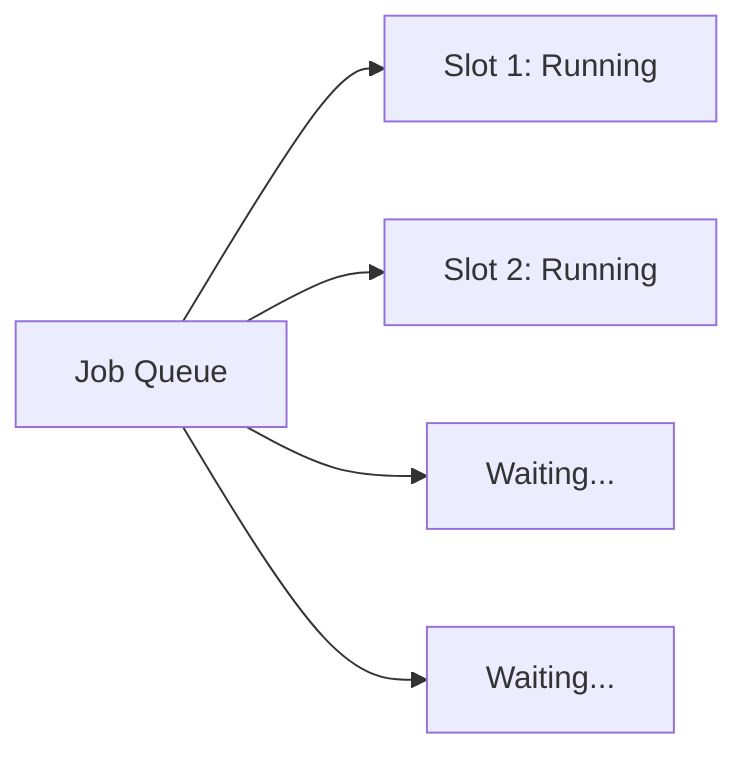

# Batch Processing

Honeymelon is designed to efficiently handle multiple file conversions simultaneously. This guide covers batch processing workflows and optimization strategies.

## Adding Multiple Files

### Drag and Drop Multiple Files

The simplest way to batch process:

1. Select multiple files in Finder (hold `Cmd` and click each file)
2. Drag the selection into Honeymelon
3. All files are added to the queue simultaneously

### Drag Entire Folders

For larger batches, drag an entire folder:

1. Drag a folder from Finder into Honeymelon
2. The app recursively discovers all supported media files
3. Each file is added as a separate job

**Folder Structure Example**:

```
Videos/
  ├── movie1.mkv
  ├── movie2.avi
  ├── Subfolder/
  │   ├── clip1.mov
  │   └── clip2.mp4
  └── project.txt (ignored)

```

Result: 4 video files added to the queue, text file ignored.

### File Picker Multi-Select

Use the native file picker for organized selection:

1. Click **Browse** in the upload area or press `Cmd + O`
2. Hold `Cmd` and click multiple files
3. Click "Open" to add them all

## Concurrent Processing

### How Concurrency Works

Honeymelon processes multiple jobs simultaneously using a **concurrency limit**:

- Default: **2 concurrent jobs**
- Configurable via advanced settings (see [Preferences](/guide/preferences))
- Queue system: Jobs start automatically as slots become available



### Concurrency Configuration

Adjust the concurrent job limit in advanced settings:

| Setting  | Best For                                        |
| -------- | ----------------------------------------------- |
| 1 job    | 4K content, complex encoding, limited resources |
| 2 jobs   | Default, balanced for most use cases            |
| 3-4 jobs | Powerful Macs, simple remux operations          |

### Resource Considerations

**CPU Usage**

- Each FFmpeg process consumes CPU cores
- Hardware acceleration may reduce CPU load when available
- Monitor Activity Monitor during heavy batches

**Memory Usage**

- Each job requires ~200-500 MB RAM
- 4K content can use 1-2 GB per job
- Ensure adequate free RAM for your concurrency level

**Disk I/O**

- Reading source files + writing output files
- SSDs handle concurrent I/O much better than HDDs
- External drives may become a bottleneck

**Thermal Management**

- Apple Silicon Macs handle thermals well
- Extended batch processing may trigger fan activity
- Consider reducing concurrency for long batches

## Batch Workflow Strategies

### Strategy 1: Uniform Conversion

Convert all files to the same format:

1. Add all files to the queue
2. Select a preset per job as needed
3. Start all conversions

**Use Case**: Converting a folder of MKV files to MP4 for compatibility.

### Strategy 2: Preset-Based Conversion

Different presets based on file type:

1. Add all files (mixed video and audio)
2. Video files automatically get `video-to-mp4`
3. Audio files automatically get `audio-to-m4a`
4. Adjust individual presets as needed
5. Start all conversions

**Use Case**: Processing a mixed media library.

### Strategy 3: Quality-Tiered Batches

Process files in quality tiers:

**Batch 1: Fast (Remux)**

- Add files that can be remuxed
- Use Fast quality tier
- Quick processing for format changes

**Batch 2: Balanced (Standard)**

- Add files needing transcoding
- Use Balanced quality tier
- General-purpose conversions

**Batch 3: High (Archival)**

- Add important files for archival
- Use High quality tier
- Maximum quality preservation

### Strategy 4: Priority Processing

Process important files first:

1. Add high-priority files first
2. Start those conversions
3. Add lower-priority files later
4. They'll queue behind the running jobs

**Use Case**: Urgent files need to be ready before bulk processing.

## Monitoring Batch Progress

### Queue Overview

The main window shows all jobs with their current state:

- **Queued**: Waiting to start (gray)
- **Running**: Currently processing (blue)
- **Completed**: Successfully finished (green)
- **Failed**: Error occurred (red)

### Progress Indicators

For each running job:

- **Percentage**: Overall progress (0-100%)
- **ETA**: Estimated time remaining

## Handling Errors in Batches

### Individual Job Failures

If a job fails:

1. The job is marked as **Failed**
2. Other jobs continue processing
3. Review the error state on the job card
4. Fix the issue and re-add the file if needed

### Common Batch Errors

**Insufficient Disk Space**

- Monitor free space during large batches
- Output files may be larger than source files
- Consider processing in smaller batches

**Corrupted Source Files**

- FFmpeg will fail on corrupted files
- Other jobs are unaffected
- Repair or remove problematic files

**Resource Exhaustion**

- Too many concurrent jobs may cause system slowdown
- Reduce concurrency limit in advanced settings
- Close other resource-intensive applications

## Advanced Batch Techniques

### Organizing Output Files

**By Source Directory** (default)

```

Input:  ~/Videos/movie1.mkv
Output: ~/Videos/movie1-video-to-mp4.mp4

```

**Custom Output Directory**

```

Input:  ~/Videos/movie1.mkv
Output: ~/Converted/movie1-video-to-mp4.mp4
```

Configure in [Preferences](/guide/preferences).

### Naming Patterns

For batch processing, consider consistent naming:

- **Default**: `filename-video-to-mp4.ext`
- **Include tier**: `filename-video-to-mp4-balanced.ext`

### Processing During Off-Hours

For large batches:

1. Add all files to the queue
2. Configure preferences (output location, quality)
3. Start the batch before leaving
4. Let it run overnight or during work hours
5. Check results when you return

Honeymelon will process the entire queue automatically.

## Performance Optimization

### Optimizing for Speed

1. **Use Fast Quality Tier**: Prioritizes remuxing
2. **Increase Concurrency**: More simultaneous jobs
3. **Avoid Transcoding**: Choose compatible target formats
4. **Use Hardware Acceleration**: Automatic for H.264 outputs when available

### Optimizing for Quality

1. **Use High Quality Tier**: Maximum quality settings
2. **Reduce Concurrency**: More resources per job
3. **Choose Efficient Codecs**: VP9/WebM for smaller web-friendly output when acceptable
4. **Monitor Resource Usage**: Prevent throttling

### Optimizing for Balance

1. **Use Balanced Quality Tier**: Default recommended settings
2. **Keep Default Concurrency**: 2 simultaneous jobs
3. **Mixed Strategy**: Remux where possible, transcode when needed

## Real-World Batch Scenarios

### Scenario 1: Convert Vacation Videos

**Context**: 50 MOV files from iPhone, need MP4 for sharing

**Strategy**:

1. Drag entire folder into Honeymelon
2. All files get `video-to-mp4` preset
3. Use **Fast** quality tier (likely remux)
4. Set concurrency to 3
5. Start batch

**Expected Result**: Fast processing (~5-10 minutes for 50 files)

### Scenario 2: Optimize Project Footage

**Context**: 100 large MKV files, need smaller web-friendly versions

**Strategy**:

1. Add all files
2. Use `video-to-webm` preset
3. Use **Balanced** quality tier
4. Set concurrency to 2
5. Start batch, let run overnight

**Expected Result**: Smaller files suited for web sharing, several hours processing

### Scenario 3: Archive Audio Collection

**Context**: 200 MP3 files, convert to FLAC for archival

**Strategy**:

1. Add all audio files
2. Use `audio-to-flac` preset
3. Quality tier doesn't matter (lossless)
4. Set concurrency to 4 (audio is less intensive)
5. Start batch

**Expected Result**: Lossless archive, ~30-60 minutes

### Scenario 4: Mixed Media Library

**Context**: 75 files (mix of video/audio, various formats)

**Strategy**:

1. Add all files at once
2. Video files > `video-to-mp4`
3. Audio files > `audio-to-m4a`
4. Use **Balanced** quality tier
5. Set concurrency to 2
6. Start batch

**Expected Result**: Uniform library format, 2-4 hours depending on transcoding needs

## Tips for Efficient Batches

1. **Group Similar Files**: Process similar files together for predictable results
2. **Test First**: Try one file before committing to a large batch
3. **Monitor Initially**: Watch the first few jobs to ensure settings are correct
4. **Check Disk Space**: Ensure adequate space for all output files
5. **Use Preset/Tier Naming**: Helps identify batch-processed files later
6. **Clear Completed Jobs**: Remove finished jobs to keep the queue clean
7. **Save Resources**: Close unnecessary applications during heavy processing

## Next Steps

- Configure [Preferences](/guide/preferences) for optimal batch processing
- Understand [Presets & Quality](/guide/presets) to choose the right settings
- Learn about the [Conversion Pipeline](/architecture/pipeline) that powers batch processing
