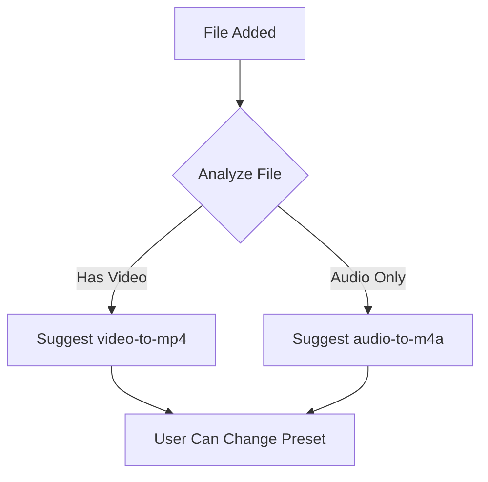
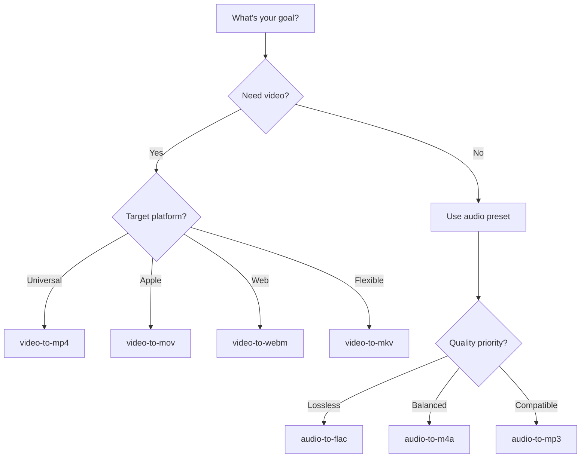

# Presets & Quality

Honeymelon uses a preset-based system to simplify media conversion. This guide explains how presets work and how to choose the right quality settings.

## What are Presets?

A **preset** defines the target format and conversion rules for a media file. Instead of manually configuring codecs, bitrates, and container formats, you simply select a preset like `video-to-mp4` or `audio-to-flac`.

### Dynamic Preset Generation

Honeymelon automatically generates presets for all valid source-to-target format combinations:

```typescript
// Example preset structure
{
  id: "video-to-mp4",
  label: "MP4 (H.264 + AAC)",
  mediaKind: "video",
  container: "mp4",
  video: { codec: "h264" },
  audio: { codec: "aac" }
}

```

This means you'll always have access to the right presets based on your file type.

## Preset Categories

### Video Presets

Convert video files to different container formats:

| Preset          | Target | Video Codec | Audio Codec | Use Case                |
| --------------- | ------ | ----------- | ----------- | ----------------------- |
| `video-to-mp4`  | MP4    | H.264       | AAC         | Universal compatibility |
| `video-to-mov`  | MOV    | H.264       | AAC         | Apple ecosystem         |
| `video-to-mkv`  | MKV    | Copy        | Copy        | Remux without re-encode |
| `video-to-webm` | WebM   | VP9         | Opus        | Web streaming           |
| `video-to-avi`  | AVI    | MPEG-4      | MP3         | Legacy compatibility    |
| `video-to-flv`  | FLV    | H.264       | AAC         | Flash video             |
| `video-to-m4v`  | M4V    | H.264       | AAC         | Apple/iTunes            |
| `video-to-ts`   | TS     | H.264       | AAC         | Broadcast streams       |
| `video-to-ogv`  | OGV    | Theora      | Vorbis      | Open source video       |
| `video-to-mpeg` | MPEG   | MPEG-2      | MP2         | DVD/Broadcast           |
| `video-to-gif`  | GIF    | GIF         | None        | Animations, memes       |

### Audio Presets

Extract or convert audio streams:

| Preset          | Target | Audio Codec | Use Case                |
| --------------- | ------ | ----------- | ----------------------- |
| `audio-to-m4a`  | M4A    | AAC         | Universal compatibility |
| `audio-to-mp3`  | MP3    | MP3         | Legacy support          |
| `audio-to-flac` | FLAC   | FLAC        | Lossless archival       |
| `audio-to-wav`  | WAV    | PCM         | Uncompressed audio      |
| `audio-to-ogg`  | OGG    | Vorbis      | Open source audio       |
| `audio-to-aac`  | AAC    | AAC         | Raw AAC                 |
| `audio-to-aiff` | AIFF   | PCM         | Apple uncompressed      |
| `audio-to-opus` | Opus   | Opus        | Efficient web audio     |

### Image Presets

Extract frames or convert images:

| Preset          | Target | Codec | Use Case              |
| --------------- | ------ | ----- | --------------------- |
| `image-to-png`  | PNG    | PNG   | Lossless screenshots  |
| `image-to-jpg`  | JPG    | JPEG  | Universal photos      |
| `image-to-webp` | WebP   | WebP  | Modern web images     |
| `image-to-bmp`  | BMP    | BMP   | Legacy uncompressed   |
| `image-to-tiff` | TIFF   | TIFF  | Professional archival |

## Quality Tiers

Each preset supports three quality tiers that control encoding parameters. Tiers only affect transcoding; when a preset can remux (copy) streams, the tier has no impact.

### Fast (Copy-Prioritized)

**Philosophy**: Preserve quality and maximize speed through remuxing.

**Behavior**:

- Copies streams whenever possible (no re-encoding)
- Only transcodes when absolutely necessary
- Uses faster encoding settings when transcoding is required

**Best For**:

- Container format changes (MKV > MP4)
- When source quality is already optimal
- Quick conversions where speed matters
- Preserving original encode settings

**Example**:

```

Source: video.mkv (H.264 + AAC)
Target: video-to-mp4 (Fast)
Result: Remux (copy both streams) - 500+ fps

```

### Balanced (Optimized)

**Philosophy**: Good quality with reasonable file sizes and encoding time.

**Behavior**:

- Uses optimized bitrates and encoder settings
- Balances quality, size, and speed
- Suitable for most general-purpose conversions

**Best For**:

- General-purpose conversions
- Web uploads (YouTube, Vimeo)
- Sharing files with others
- Reducing file sizes while maintaining quality

**Example**:

```

Source: video.mov (ProRes + PCM)
Target: video-to-mp4 (Balanced)
Result: Transcode to H.264/AAC - 30-60 fps

```

### High (Maximum Quality)

**Philosophy**: Preserve maximum quality regardless of file size or encoding time.

**Behavior**:

- Uses higher bitrates and slower encoder presets
- Prioritizes quality over all other factors
- Produces larger files with longer encoding times

**Best For**:

- Archival purposes
- Professional video editing workflows
- When quality is paramount
- Creating master copies

**Example**:

```

Source: video.mov (4K ProRes)
Target: video-to-mp4 (High)
Result: Transcode to H.264/AAC with higher quality settings - 10-20 fps

```

## Encoding Controls (When Applicable)

Honeymelon applies tier-specific settings only when a preset transcodes. Depending on the codec, this may include:

- **CRF** (quality-based video encoding)
- **Bitrate targets** (video or audio)
- **Codec-specific quality knobs** (for example, VBR quality for MP3)

Exact values can vary by preset and may evolve over time as defaults are tuned.

## Preset Selection Logic

When you add a file, Honeymelon suggests a preset based on the file type:



You can always change the preset before starting the conversion.

## Codec Compatibility (Preset Targets)

Honeymelon presets target a specific codec pair per container. When input codecs do not match, the app transcodes to the preset targets.

| Container | Video Codec | Audio Codec | Notes                  |
| --------- | ----------- | ----------- | ---------------------- |
| MP4       | H.264       | AAC         | Standard compatibility |
| MOV       | H.264       | AAC         | Apple-friendly         |
| MKV       | Copy        | Copy        | Remux only             |
| WebM      | VP9         | Opus        | Web streaming          |
| AVI       | MPEG-4      | MP3         | Legacy playback        |
| FLV       | H.264       | AAC         | Legacy Flash video     |
| M4V       | H.264       | AAC         | Apple/iTunes           |
| TS        | H.264       | AAC         | Broadcast streams      |
| OGV       | Theora      | Vorbis      | Open source video      |
| MPEG      | MPEG-2      | MP2         | DVD/Broadcast          |
| GIF       | GIF         | None        | No audio               |

## Hardware Acceleration

Honeymelon prefers hardware-accelerated encoders when available for the target codec (for example, H.264 presets). Availability depends on your FFmpeg build.

**Benefits**:

- Faster encoding on supported codecs
- Reduced CPU usage
- Lower power consumption

**Limitations**:

- Quality may be slightly lower than software encoding
- Some advanced features not available (e.g., custom tune settings)

::: info
Hardware acceleration is automatically selected. No configuration required!
:::

## Custom Presets (Future)

Currently, Honeymelon uses predefined presets. Future versions will support:

- Custom preset creation
- Preset templates
- Per-codec configuration
- Advanced stream mapping
- Filter chains (crop, scale, denoise)

## Choosing the Right Preset

### Decision Tree



### Common Scenarios

**Scenario: Convert for iPhone/iPad**

- Preset: `video-to-mp4` or `video-to-mov`
- Quality: Balanced or High
- Reason: Native format for iOS devices

**Scenario: Upload to YouTube**

- Preset: `video-to-mp4`
- Quality: Balanced
- Reason: YouTube recommends H.264/AAC in MP4

**Scenario: Archival Storage**

- Preset: `video-to-mkv`
- Quality: High
- Reason: Remux to a flexible container without re-encoding

**Scenario: Quick Container Change**

- Preset: Any matching source codecs
- Quality: Fast
- Reason: Remux without transcoding

**Scenario: Extract Lossless Audio**

- Preset: `audio-to-flac`
- Quality: Any (lossless by default)
- Reason: No quality loss from original

## Next Steps

- Learn about [Converting Files](/guide/converting-files) for detailed workflows
- Explore [Batch Processing](/guide/batch-processing) for efficient multi-file conversion
- Understand the [Conversion Pipeline](/architecture/pipeline) architecture
